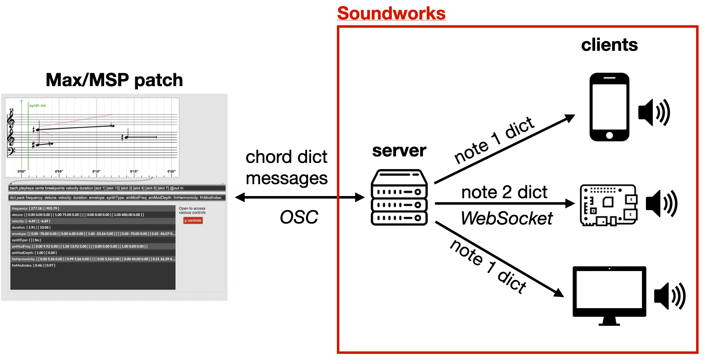

# `Koryphaios`

_Koryphaios_ is an environment for composition of distributed music performance on a local network of device. It connects the [_bach_ library for Max/MSP](https://www.bachproject.net/) and the [_soundworks_ framework](http://collective-soundworks.github.io) for distributed multimedia application.  

_Koryphaios_ works by sending your composition in Max/MSP to a server which then dispatches the various notes among a local network of devices (e.g. computers, mobile phones, ...). These devices then synthesize the requested sound in the browser using the [WebAudio API](https://developer.mozilla.org/fr/docs/Web/API/Web_Audio_API).



## Requirements  
You will need : 

- [Node.js](https://nodejs.org/en/) latest LTS version
- Max/MSP
- The bach library for Max/MSP (download [here](https://www.bachproject.net/) or through Max's package manager)
- [The soundworks Max package](https://github.com/collective-soundworks/soundworks-max)


_Koryphaios_ unravels its full potential when used on a local network. We assume you know how to create such a network.

## Install 

1. **Download the application** 
2. **Add the application's directory to your Max/MSP path**  
In Max/MSP : Options > File Preferences...
3. **Install the application**  
Using the terminal move to the application's directory 
```cd /path_to_koryphaios/```  
Then install the necessary node modules  
```npm install```  
```npm run build```

## Launching

Move to the application's directory   
```cd /path_to_koryphaios/```  
then start the server with  
```npm run start```

## Getting started

To get started with _Koryphaios_ you can take a look at the help patch in Max/MSP (found in `max/examples/`) or at the [_First example_](https://github.com/ircam-ismm/koryphaios/wiki/First-example) page on the wiki

More information is available on the [wiki](https://github.com/ircam-ismm/koryphaios/wiki)

## License

BSD-3-Clause
